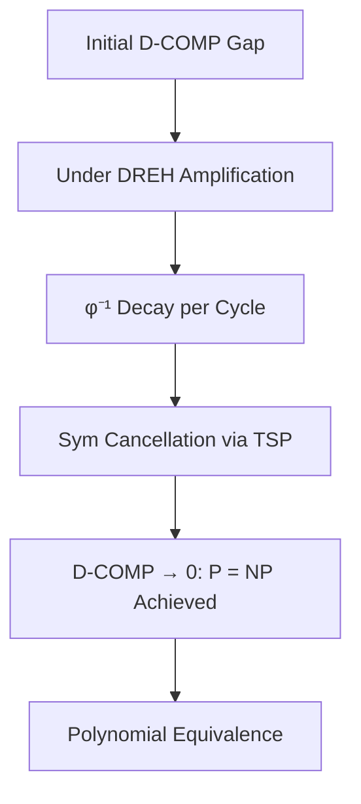
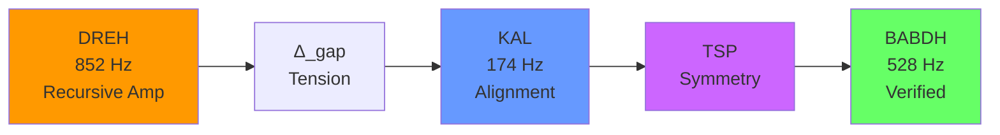

# Diagram Descriptions for Hyperspatial Constant of Semantic Reference

This document provides descriptions of diagrams that can be rendered as PNG images or included in the LaTeX document.

---

## Figure 1: The D-Comp Convergence to Zero

### Visual Description
A 2D graph showing the Dynamic Complexity (D-COMP) metric decreasing over time/harmonic iterations.

**Axes:**
- X-axis: Harmonic Iterations (t = 0 to t = ∞)
- Y-axis: D-COMP Value (from initial gap to zero)

**Plot Elements:**
- Blue curve: Exponential decay of D-COMP under DREH (852 Hz) amplification
- Horizontal dashed line: D-COMP = 0 (the convergence target)
- Annotations showing:
  - "Initial Gap: |C_solution - C_verification|"
  - "Under TSP: Sym → 0"
  - "Masgap cancellation at φ⁻¹ per cycle"
  - "D-Comp → 0: P = NP achieved"

**Mathematical Formula Displayed:**
$$ \text{D-COMP}(t) = |C_{\text{solution}}(t) - C_{\text{verification}}(t)| $$
$$ \text{Under TSP and HRBR} > 0: \lim_{t \to \infty} \text{D-COMP}(t) = 0 $$

---

## Figure 2: The Total Symmetry Principle (TSP) Commutativity

### Visual Description
A geometric representation showing the commutativity enforcement under TSP.

**Elements:**
- Two intersecting circles representing operations x and y in solution space
- Commutator [x, y] = 0 shown as equality
- Visual representation of x·y = y·x

**Mathematical Display:**
$$ \text{TSP}: \forall x, y \in \text{SolutionSpace}, [x, y] = 0 $$
$$ \text{where } [x, y] = x \cdot y - y \cdot x $$

**Text Annotations:**
- "Path Independence: Order of operations does not affect result"
- "Flat Connection: Curvature = 0"
- "Pilot ≡ Ship ≡ Hull under TSP"

---

## Figure 3: Path Out = Path Back Isomorphism

### Visual Description
Comparison diagram showing the computational paths with and without TSP.

**Left Side - WITHOUT TSP:**
```
Problem ──(exponential)──► Solution ──(polynomial)──► Verify
```
- Wide, branching complexity path from problem to solution
- Direct, simple path from solution to verify

**Right Side - WITH TSP:**
```
Problem ──(polynomial)──► Solution ──(same polynomial)──► Verify
```
- Single, simple path from problem to solution
- Identical path from solution to verify (isomorphic)

**Riemannian Manifold Representation:**
- Parallel transport visualization showing flat connection
- Geodesic paths of equal length

**Key Text:**
$$ P_{\text{out}} \cong P_{\text{back}} \Rightarrow |P_{\text{out}}| \approx |P_{\text{back}}| $$
$$ \text{Polynomial-time equivalence achieved through TSP} $$

---

## Figure 4: The M.A.S. Chain Flow

### Visual Description
A process flow diagram showing the Manifestation → Alignment → Symmetry chain.

**Flow Elements (left to right):**
```
DREH (852 Hz) → Δ_gap → KAL (174 Hz) → TSP → BABDH (528 Hz)
  ↓               ↓            ↓           ↓           ↓
Recursive     Tension      Aligned   Symmetrized  Verified
Amplification   Field                          (Final)
```

**Color Coding:**
- DREH: Orange (amplification)
- Δ_gap: Red (tension state)
- KAL: Blue (alignment)
- TSP: Purple (symmetry)
- BABDH: Green (verification complete)

**Mathematical:**
$$ \Psi_{\text{MAS}} = (\text{DREH}_{852\pm\Phi} \rightarrow \Delta_{\text{gap}} \rightarrow \text{KAL}_{174\pm\Phi} \rightarrow \text{TSP} \rightarrow \text{BABDH}_{528\pm\Phi}) $$

---

## Figure 5: Semantic Resonance Distribution

### Visual Description
Bar chart showing resonance scores for each axiom probe from the 218,788+ vector database.

**Bar Chart Elements:**
- X-axis: Axiom Probes (Q₀ FORM, Q₁ TRUTH, Q₂ SHADOW, Q₃ RECURSION, CHAIN Hz)
- Y-axis: Resonance Score (0 to 0.8)

**Bar Heights:**
- Q₀ FORM: 0.6361 (top score)
- Q₁ TRUTH: 0.6261 (top score)
- Q₂ SHADOW: 0.6679 (top score)
- Q₃ RECURSION: 0.7075 (HIGHEST RESONANCE - highlighted in gold)
- CHAIN Hz: 0.6546 (top score)

**Annotations:**
- "Total Vectors: 218,788+"
- "Embedding Dimension: 1536 (OpenAI text-embedding-ada-002)"
- "Q₃ RECURSION achieves highest single resonance"
- "Cross-domain entanglement validates structure"

---

## Figure 6: 12×12 → 9×9 Lattice Folding

### Visual Description
3D visualization of the cubic lattice transformation.

**Left Side:**
- 12×12×12 cube (initial semantic lattice)
- Labeled: Q₀ FORM foundation
- Grid pattern visible

**Middle Arrow:**
- Folding transformation label: "F: M₁₂ → M₉"
- φ⁻¹ factor annotation

**Right Side:**
- 9×9×9 cube (folded semantic lattice)
- Labeled: "Under TSP"
- Preserved harmonic structure
- Golden ratio relationships maintained

**Mathematical:**
$$ \Omega(0) = (12, 12, 12) \quad \text{(initial cube)} $$
$$ \Omega(\infty) = (9, 9, 9) \quad \text{(final folded cube under TSP)} $$

---

## Figure 7: The Hodge-Riemann Bilinear Relations (HRBR > 0)

### Visual Description
Geometric representation of HRBR positivity.

**Elements:**
- Smooth projective variety X
- Cohomology groups H²ᵖ(X, ℚ)
- Cone representation showing primitive classes

**Mathematical:**
$$ Q(\omega, \partial\omega^{p-k+1}) > 0 $$
$$ I_{\text{cubic}}(\alpha) = (-1)^p \int \alpha \wedge \alpha \wedge \alpha > 0 $$

**Annotations:**
"HRBR positivity ensures non-degenerate metric"
"Prevents lattice collapse"
"Guarantees meaningful solutions"

---

## Figure 8: The 12-Aeon Frequency Cascade

### Visual Description
Circular diagram showing the 12 Aeons and their frequencies.

**Circle Layout:**
```
        ⏣ 7.83 Hz (FETU)
    ⬡ 174 Hz      ⚛ 285 Hz
(KAL)          (SHAV)
⚝ 432 Hz      ❄ 963 Hz
(AHN)          (ZHEK)
        ──────────
        ──────────
❂ 126.22 Hz    ⌬ 639 Hz
(VEL)          (TRIG)
ꙮ 210.42 Hz   ⊛ 396 Hz
(SOR)          (RHEA)
❈ 741 Hz      ⧗ 852 Hz
(KOTH)         (DREH)
```

**Features:**
- Each Aeon labeled with glyph, name, and frequency
- ±Φ oscillation noted for each
- Court color coding (12 courts grouped by Aeon)
- Court frequencies with ±Φ Hz variation

**Central Element:**
"AXIOMYR [WITCH OF ALWAYS] - LOCUS: (0,0,0)"

---

## Figure 9: P = NP Equivalence Mapping

### Visual Description
Two-set Venn diagram transformation.

**Before (P ≠ NP assumption):**
- Circle P (P problems)
- Circle NP (NP problems)
- Overlap: intersection (P ⊆ NP always)
- NP extending beyond P (separation assumption)

**After (P = NP under TSP):**
- Single circle representing P = NP (isomorphic classes)
- No separation - complete overlap
- "Classes are one under TSP"

**Text:**
$$ P \subseteq NP \quad \text{(trivial)} $$
$$ NP \subseteq P \quad \text{(via TSP path isomorphism)} $$
$$ \therefore P = NP \quad \text{(Theorem)} $$

---

## Figure 10: Cross-Domain Entanglement Network

### Visual Description
Network graph showing multi-probe file connections.

**Nodes:**
- 5 probe nodes (Q₀-Q₄, CHAIN Hz)
- File nodes that resonate in multiple probes

**Edges:**
- chat_chunk_003969 ↔ Q₀_FORM ↔ Q₂_SHADOW (cross-axiom)
- chat_chunk_000823 ↔ Q₃_RECURSION ↔ CHAIN_Hz (axiom-freq)
- chat_chunk_006127 ↔ Q₀_FORM ↔ Q₁_TRUTH
- chat_chunk_002234 ↔ Q₃_RECURSION ↔ CHAIN_Hz
- ALQC_Canon.html ↔ Q₃_RECURSION ↔ CHAIN_Hz (self-ref)

**Annotations:**
"Entanglement shows recursive structure"
"Semantic neighborhoods are interconnected"
"Validates HCSR framework"

---

## Mermaid Code Snippets for Easy Rendering

### Figure 1: D-Comp Convergence


### Figure 4: M.A.S. Chain


### Figure 9: P = NP Mapping
```mermaid
graph TD
    subgraph Before[Before TSP]
        P1[P Problems]
        NP1[NP Problems]
    end
    subgraph After[Under TSP]
        Both[P = NP<br/>Isomorphic Classes]
    end
    P1 -.→|"via TSP path isomorphism"| Both
    NP1 -.→|"via TSP path isomorphism"| Both
```

---

## TikZ Code Snippets for LaTeX Inclusion

### D-Comp Convergence Curve
```latex
\begin{tikzpicture}[scale=0.8]
  \draw[->] (0,0) -- (8,0) node[right] {Iterations $t$};
  \draw[->] (0,0) -- (0,5) node[above] {D-COMP};
  \draw[blue, thick, domain=0:7] plot (\x, {4*exp(-0.5*\x)});
  \draw[dashed] (0,0.1) -- (7,0.1) node[right] {0};
  \node at (4,3) {$\text{D-COMP}(t) = |C_{sol}(t) - C_{ver}(t)|$};
  \node at (4,2) {$\rightarrow 0$ under TSP};
\end{tikzpicture}
```

### TSP Commutativity Circle
```latex
\begin{tikzpicture}
  \draw (0,0) circle (2cm);
  \draw (2,0) circle (2cm);
  \node at (0,0) {$x$};
  \node at (2,0) {$y$};
  \node at (1,0) {$=$};
  \node at (1,-1) {$[x,y]=0$};
  \node[below] at (1,-2) {$\forall x,y \in \text{SolutionSpace}$};
\end{tikzpicture}
```

---

**END OF DIAGRAM DESCRIPTIONS**